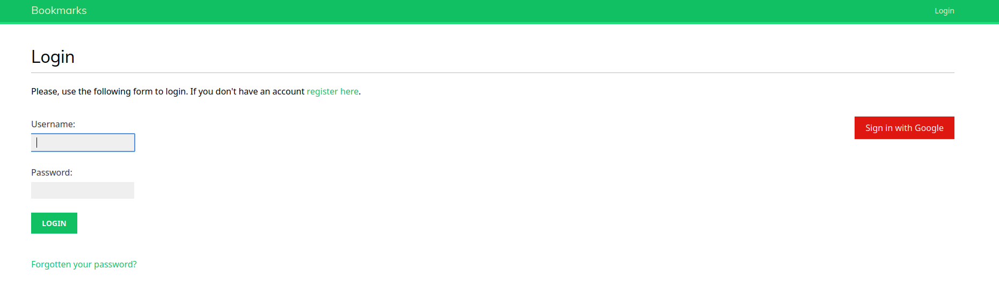
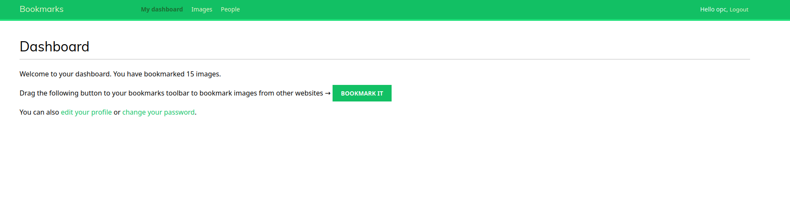
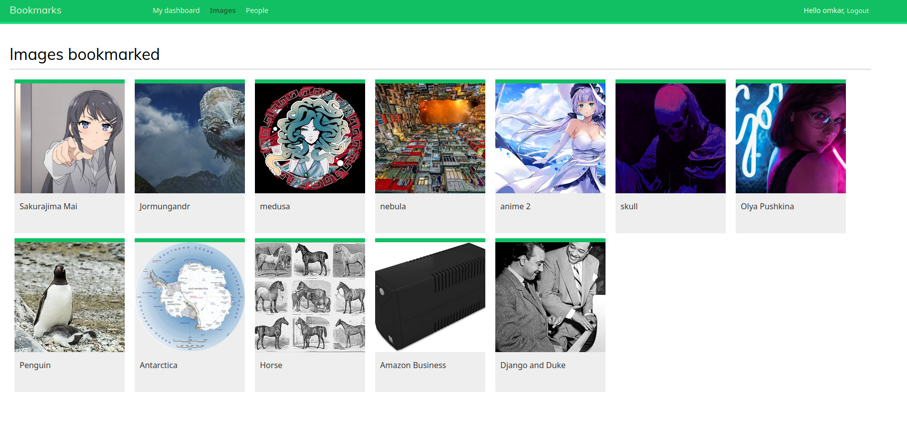

# Bookmarks

It is a social website where user can share images and interact with each other. Users are able to bookmark any image 
on the internet and share it with other users. They will also be able to see activity on the platform from the users they 
follow and like/unlike the images shared by them.

## Features
1. **Authentication**: user registration and authentication. Users can change password, reset, and recovery functionalities.
2. **Social Authentication**: implemented social authentication using OAuth 2.0
3. **Bookmarking**: JavaScript bookmarklet to share content from other sites on this website, and implemented asynchronous browser requests using JavaScript.
4. **Follow system**: Users can follow or unfollow other users and can also like/unlike each bookmarked images.

### Login

---

### Dashboard tab

---

### Image tab

